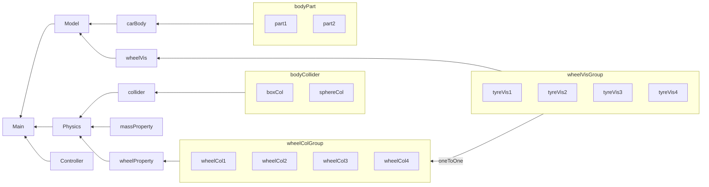

---
aliases:
- Task
cover: /gallery/Unity.png
date:
- 2023-05-09 21:58:07
tags:
- json
- csharp
- Unity
- comment&doc
thumbnail: /thumb/Unity.png
title: m1
toc: true

---

<!--toc:start-->
- [Task](#task)
- [Vehicle Physics Pro](#vehicle-physics-pro)
  - [Needs](#needs)
  - [Install](#install)
- [GLTFUtility](#gltfutility)
  - [Needs](#needs)
  - [Install](#install)
  - [Runtime API](#runtime-api)
  - [Trouble shooting](#trouble-shooting)
- [Csharp's interpretation of Json](#csharps-interpretation-of-json)
- [Abstract the vehicle as a Json structure](#abstract-the-vehicle-as-a-json-structure)
  - [Graph](#graph)
  - [Json example](#json-example)
<!--toc:end-->

## Task
- [x] Load car configuration from .json file 
- [ ] Compose DevDocs
- [ ] Investigate csharp comment documentation
- [x] use assimp to load .glb model
****
## Vehicle Physics Pro
**Starting point**
The unity's build-in physics engine PhysX is far from being precise enough for a vehicle simulator.

### Needs
- Closer to reality vehicle physics
- Runtime performance
- Not so complicated to config so that the composition of the savings and editor will not be a headache

[Official](https://vehiclephysics.com/)

### Install
Through [Asset Store](https://assetstore.unity.com/packages/tools/physics/vehicle-physics-pro-community-edition-153556)

---

## GLTFUtility
**Starting point**
The car model should be customizable, i.e. the user drag a car model into a directory and the game should be able to load it.
Filetype .glb is nice but unity doesn't have build-in support

### Needs
- Runtime import
- support mesh and material

[GLTFUtility](https://github.com/Siccity/GLTFUtility)

### Install
In tactics project:
```bash
git submodule add https://github.com/Siccity/GLTFUtility.git ./Tactics/Assets/ThirdParty/GLTFUtility
```

### Runtime API
 ```cpp
using Siccity.GLTFUtility

// Single thread
void ImportGLTF(string filepath){
    GameObject res = Importer.LoadFromFile(filepath);
}

// Multi thread
void ImportGLTFAsync(string filepath){
    Importer.ImportGLTFAsync(filepath, new ImportSettings(), OnFinish);
}
void OnFinish(){
    ...
}
```
here I use `Application.streamingAssetsPath+"/Model/"+JsonReader.vehicle.model.carBody[0].dir` as `filepath`

### Trouble shooting
1. In the built game, encounter `ArgumentNullException: Value cannot be null. Parameter name: shader`
    [Github Issue](https://github.com/Siccity/GLTFUtility/issues/38)
2. The file management of the game changed after being built. How to determine where to place the `Save` and `Model` folders?
    Use `Application.streamingAssetsPath`, stands for `Assets/StreamingAssets` in Unity editor and `Game_Data/StreamingAssets` in exported game.


****
## Csharp's interpretation of Json
First construct the structure of the json file in c#.
**Notice:** the name of the member variable should be the same with those in json file 
```cpp
[System.Serializable]
public class VehiclePhysicsPara
{
    public float bodyMass;
    public Vector3 centerOfMass;
    public List<BodyColliderPara> collider;
    public List<WheelColliderPara> wheel;
}

[System.Serializable]
public class BodyColliderPara
{
    public string type; // box | sphere
    public Vector3 position;
    public Vector3 eulerRotation;
    public Vector3 scale;
}
[System.Serializable]
public class SteeringWheelTypePara
{
    public bool use;
    public bool inverse;
}
[System.Serializable]
public class WheelTypePara
{
    public bool powered;
    public SteeringWheelTypePara steering;
}
[System.Serializable]
public class WheelSuspensionPara
{
    public float spring;
    public float damper;
    public float distance;
    public float initialPosition;
}
[System.Serializable]
public class WheelFrictionPara
{
    public float extremumSlip;
    public float extremumValue;
    public float AsymptoteSlip;
    public float AsymptoteValue;
}

[System.Serializable]
public class WheelColliderPara
{
    public WheelTypePara type;
    public float mass;
    public float radius;
    public Vector3 position;
    public WheelSuspensionPara suspension;
    public WheelFrictionPara forwardFriction;
    public WheelFrictionPara sidewayFriction;
}

[System.Serializable]
public class VehicleModelPara
{
    public List<CarBodyPara> carBody;
    public List<WheelModelPara> wheel;
}
[System.Serializable]
public class CarBodyPara
{
    public string name;
    public string dir;
    public Vector3 position;
    public Vector3 eulerRotation;
    public Vector3 scale;
    public string shader;
}
[System.Serializable]
public class WheelModelPara
{
    public string name;
    public string dir;
    public Vector3 scale;
    public string shader;
}
[System.Serializable]
public class VehiclePara
{
    public VehicleModelPara model;
    public VehiclePhysicsPara physics;  
}
```
**Notice:** `[System.Serializable]` is for serialized display in Unity editor. 

Then, directly use build-in json loader:
```csharp
VehiclePara vehicle;
vehicle = JsonUtility.FromJson<VehiclePara>(textJson.text);
```
All the parameters will be stored in the instance `vehicle` 


****
## Abstract the vehicle as a Json structure
### Graph

### Json example
```json
{
    "model":{
        "carBody":[
            {
                "name":"body1",
                "dir":"./CustomModel/car1/body1.obj",
                "position":{"x":0,"y":0,"z":0},
                "eulerRotation":{"x":0,"y":0,"z":0},
                "scale":{"x":0,"y":0,"z":0},
                "shader":"Standard"
            },
            {
                "name":"body2",
                "dir":"./CustomModel/car1/body2.obj",
                "position":{"x":0,"y":0,"z":0},
                "eulerRotation":{"x":0,"y":0,"z":0},
                "scale":{"x":0,"y":0,"z":0},
                "shader":"Standard"
            }
        ],
        "wheel":[
            {
                "name":"wheel1",
                "dir":"./CustomModel/car1/wheel1.obj",
                "scale":{"x":0,"y":0,"z":0},
                "shader":"Standard"
            }
        ]
    },
    "physics":{
        "collider":[
            {
                "type":"box",
                "position":{"x":0,"y":0,"z":0},
                "eulerRotation":{"x":0,"y":0,"z":0},
                "scale":{"x":0,"y":0,"z":0}
            },
            {
                "type":"sphere",
                "position":{"x":0,"y":0,"z":0},
                "eulerRotation":{"x":0,"y":0,"z":0},
                "scale":{"x":0,"y":0,"z":0}
            }
        ],
        "centerOfMass":{"x":0,"y":0,"z":0},
        "bodyMass":700,
        "wheel":[
            {
                "type":{"powered":true,"steering":{"use":true,"inverse":false}},
                "mass":7,
                "radius":0.5,
                "position":{"x":0,"y":0,"z":0},
                "suspension":{
                    "spring":25000,
                    "damper":9000,
                    "distance":0.3,
                    "initialPosition":0.5
                },
                "forwardFriction":{
                    "extremumSlip":0.1,
                    "extremumValue:":1,
                    "AsymptoteSlip":0.2,
                    "AsymptoteValue":0.8
                },
                "sidewayFriction":{
                    "extremumSlip":0.05,
                    "extremumValue:":1,
                    "AsymptoteSlip":0.2,
                    "AsymptoteValue":0.8
                }
            }
        ]
    }
}
```


